# relatorio-php
Projeto para estudar relatórios em php

# RESUMÃO SOBRE iREPORT e PHPJASPERXML

    O iReport é um desenhador de layouts para JasperReports.
    Além de ser muito intuitivo e de fácil uso, é útil em praticamente
    todas as necessidades na confecção de um relatório. Traz diversas
    opções como uso de código de barras, sub-relatórios e etc. O
    iReport permite que os relatórios sejam gerados em XML, PDF, HTML,
    DOCX, ODT, dentre outros formatos.  
    Ao inserir as informações de conexão com o banco de dados (o iReport
    traz diversas opções como JDBC, Conexão com Hibernate, XML e etc) 
    é gerado um arquivo de extensão jrxml. 
    Ao ser compilado, um arquivo de extensão jasper também é gerado 
    (arquivo executável do relatório). Faz analogia à linguagem Java, 
    que tem o código residente nos arquivos de extensão JAVA 
    (no caso do iReport, extensão jrxml). Depois de compilados são gerados
    arquivos de extensão CLASS (no iReport, jasper).
    
    O PHPJasperXML possibilita a leitura de arquivos jrxml, feitos
    utilizando o iReport, para transformá-los em relatórios no formato
    PDF, com o auxílio da classe TCPDF. É escrito em PHP e muito fácil
    de ser configurado. É também uma solução alternativa ao PHP/Java Bridge.
    Para seu uso é necessário basicamente editar o arquivo setting.php, que
    contém as variáveis indicativas da conexão com banco de dados.
    O arquivo PHPJasperXML.inc.php contém a classe PHPJasperXML, que faz todo
    o “trabalho pesado” de conectar com o banco de dados (vem
    configurada para MySQL), ler o conteúdo arquivo jrxml e junto com a
    classe tcpdf, gerar o relatório em PDF.

    

# ENTENDENDO O QUE FOI USADO NO PROJETO

Distro utilizada: Debian 8

1- Instalação do iReport Designer:

    a) Acessar o link http://community.jaspersoft.com/project/ireport-designer/releases 
    b) Baixar o arquivo iReport-5.6.0.tar.gz
    c) Deverá ter conta no jasper community para poder fazer o download. 
    d) Descompactar o arquivo: # tar -xvf iReport-5.6.0.tar.gz
    e) Mover a pasta para opt: # mv iReport-5.6.0 /opt
    f) Tentar executar o programa: sh /opt/iReport-5.6.0/bin/ireport
    g) Caso não funcione e mostre o erro:
       "Java HotSpot(TM) 64-Bit Server VM warning: ignoring option MaxPermSize=512m; support was removed in 8.0"
        
    h) Acesse o link para baixar a jdk7 http://www.oracle.com/technetwork/pt/java/javase/downloads/jdk7-downloads-1880260.html 
    i) Descompacte o arquivo: # tar -xvf jdk-7u79-linux-x64.tar.gz
    j) Mova para: # mv jdk1.7.0_79/ /opt/
    k) Acessar a pasta iReport-5.6.0/etc  dentro de opt
    l) Alterar o arquivo ireport.conf: nano ireport.conf
    m) Alterar a variável para: jdkhome="/opt/jdk1.7.0_79" (ctrl + o para salvar enter e ctrl x para fechar ; não esquecer de tirar o comentário do parametro (#jdkhome))
    n) Execute novamente o programa: sh /opt/iReport-5.6.0/bin/ireport
    
    - Para colocar ícone do iReport no Debian: 
        a) Clicar com o botão direito no menu > "Editar Aplicativos" 
        b) Escolher uma arvore onde você quer colocar
        c) Clicar em "Novo Item"
        d) Dar um nome, colocar o comando sh /opt/iReport-5.6.0/bin/ireport e um ícone > Salvar

2- Colocando o PHPJasperXML (Já esta no projeto, é somente para ensinar)
    
    a) Acessar o link http://www.simitgroup.com/?q=PHPJasperXML
    b) Criar uma pasta chamada PHPJasperXML e entrar nela: cd PHPJasperXML
    c) Descompactar o arquivo: ../ unzip phpjasperxml_0.9d.zip

3- Criar banco de dados 

    a) Fazer git clone do projeto 
    b) Rodar o script: banco/db_relatorio_php.sql

4- Criando o Report no iReport (Já esta no projeto, é somente para ensinar)

    a) Abrir iReport
    b) No menu Arquivo > Clicar em New > Escolher a Sessão Report > Escolher o modelo Blank A4 > Clicar no botão "Open This Template"
    

    c) No campo "Report Name" colocar um nome para o seu relatório
    d) No campo "Location" selecionar um caminho para o arquivo > Clique em Próximo > Clique em Finalizar

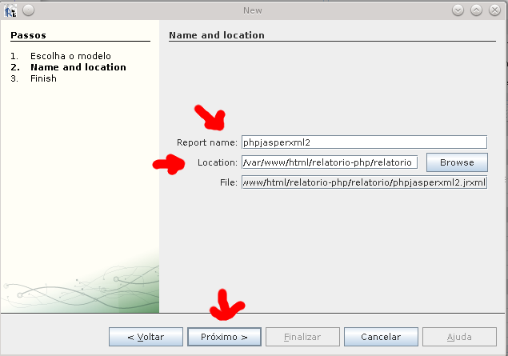

    e) Clicar no ícone Report Datasources para criar uma nova conexão com o banco de dados

    f) Na nova janela que irá aparecer clicar em New
    g) Em seguida escolher a opção "Database JDBC connection" > Clicar no botão Next 

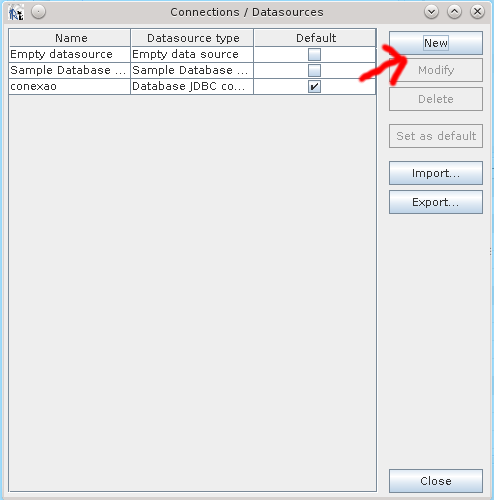

    h) No campo nome colocar um nome para a conexão (é somente um nome para identificar a conexão no iReport) > No campo JDBC Driver escolher o drive, no meu caso utilizei o MySQL (com.mysql.jdbc.Driver) > No campo JDBC URL colocar o url da conexao com o banco.
        
    - Exemplo: jdbc:mysql://localhost/db_relatorio_php
                    Endereço da maquina onde o banco de encontra. Ex: 192.168.0.1;
                    Porta de conexão do banco; Default 1521;
                    A instancia do banco. Ex: oradata;

    i) No campo "Username" colocar nome do usuário do banco e no campo "Password" colocar senha do banco > Clicar no botão "Test" para testar conexão > Clicar no botão Save

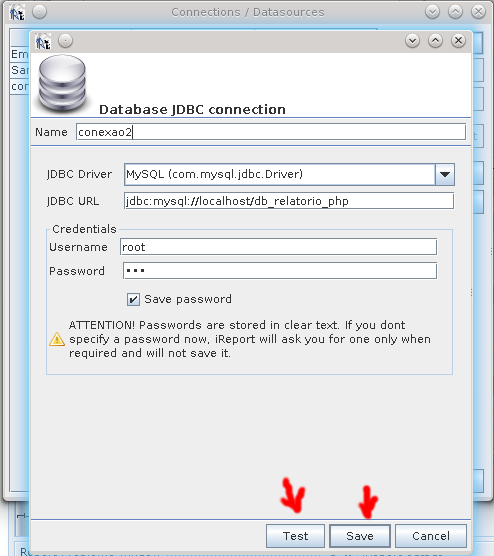

    j) Selecionar a conexão que foi criada.

    k) Para poder visualizar o relatório no próprio iReport no menu Preview > Selecionar a opção PDF Preview

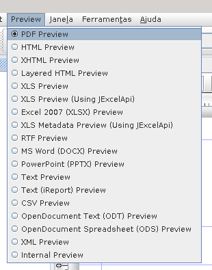

    l) Clicar no icone de DB do relatório para adicionar a query

    m) Na aba "Report" colocar a query: SELECT * FROM usuarios;
    n) Clicar em Save query

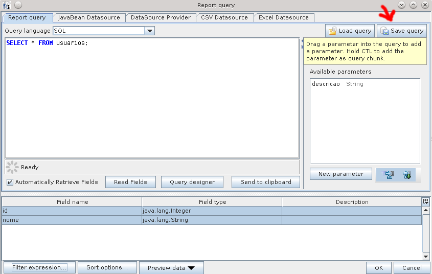

 
    o) No panel "Report Inspector" > Clicar em fields para ver se as colunas do select estão lá.

    p) No panel "Report Inspection" > Clique com o botão direito em Parameters > Clicar em Adicionar Parameter

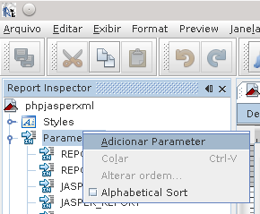

    q) Será criado um parameter com nome parameter1, poré é necessário alterar o nome. 
    r) Clique com o botão direito em cima do parametro criado > Em seguida clique em renomear e de um novo nome para o parametro

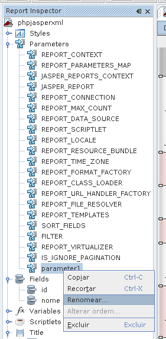

    s) Clique em cada field ou parametro e arraste-os para a área de designer
    t) Posicione os fields em Detail
    u) Posicione os parametros em Column Header

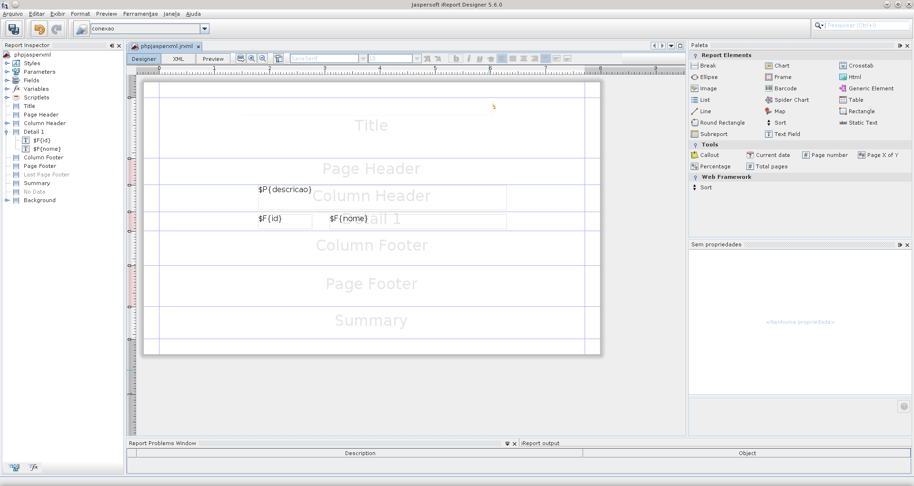

    v) Na área de designer clique em cada field e no painel Propriedades clique em "Text Field Expression"

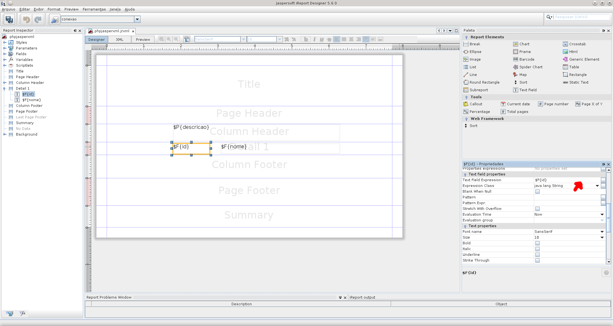

    w) Na tela "Text Field Expression" selecionar na primeira coluna a opção Fields e na segunda coluna selecionar a coluna do banco que pertence aquele field > Clicar em OK

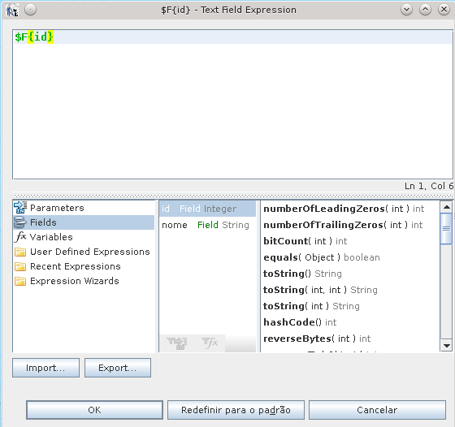

    x) Na área de designer clique em cada parametro e no painel Propriedades clique em "Text Field Expression"

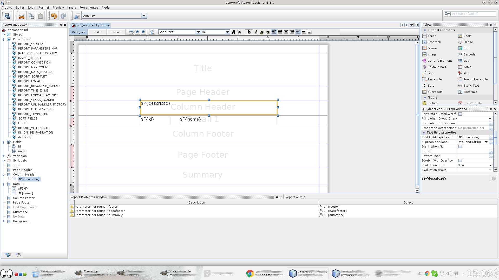

    w) Na tela "Text Field Expression" selecionar na primeira coluna a opção Parameters e na segunda coluna selecionar o parametro a que pertence aquele parametro > Clicar em OK

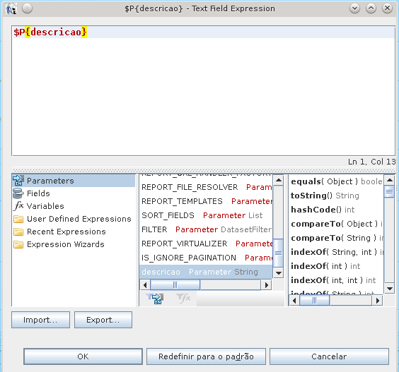

    z)Obs: Nas propriedades "Text Field Expression" quando são fields do banco, eles tem que ficar na cor verde, pois significa que não esta com erro. Os parametros continuam vermelhos mesmo estando certos.
    aa) Para verificar se o seu relatório esta mostrando os dados correatamente clique na aba Preview para visualizar a prévia do PDF.
    ab) Caso não mostre o Preview signifca que o relatório esta com erro e precisa corrigir.

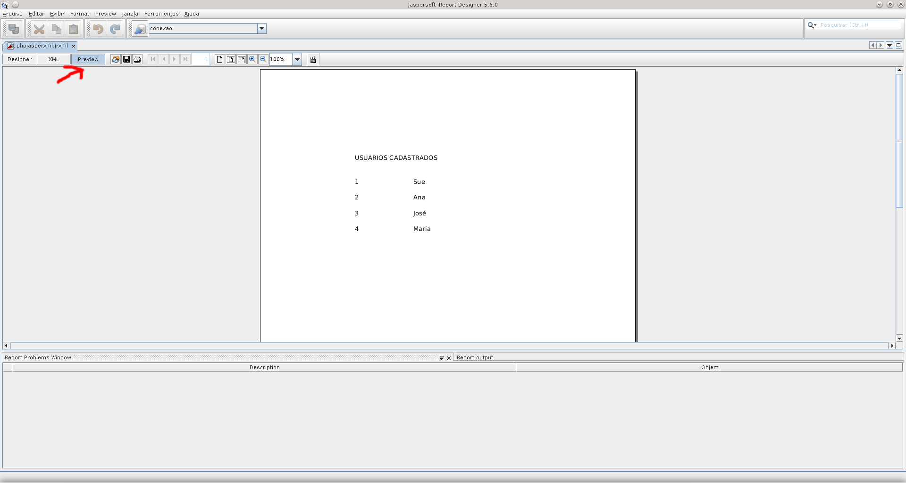

5- Preparando o projeto (Somente para ensinar)

    a) Criar uma pasta para o projeto e colocá-la em html. Ex.: relatorio-php
    b) Criar uma pasta PHPJasperXML. Ex.: relatorio-php/PHPJasperXML
    c) Criar uma pasta banco. Ex.: relatorio-php/banco
    d) Criar uma pasta relatorio. Ex.: relatorio-php/relatorio
    e) Criar um arquivo php que irá instanciar a classe PHPJasperXML. Ex.: exemplorelatorio.php
    f) Criar um arquivo index que poderá receber os dados e após o submit enviar para o exemplorelatorio.php. Ex: index.php
    g) Dentro da pasta PHPJasperXML coloque a pasta class e o arquivo setting.php do PHPJasperXML, que foi baixado no passo "2".
    h) Dentro da pasta banco coloque o script que será utilizado para criação do banco de dados, somente para organização.
    i) Somente por organização, coloque também dentro da pasta banco a query que foi salva no iReport, no passo "4- i)"
    j) Dentro da pasta relatorio salve o arquivo .jrxml criado pelo iReport.
    k) Altere o arquivo relatorio-php/PHPJasperXML/setting.php informando a conexão com o banco de dados. Ver exemplo: relatorio-php/PHPJasperXML/setting.php
    l) Altere o arquivo index para criar um formulario que passa as informações por get ou post. Ver exemplo: relatorio-php/index.php
    m) Altere o arquivo exemplorelatorio.php para instanciar a classe PHPJasperXML e passar as informações para a geração do PDF. Ver exemplo: relatorio-php/exemplorelatorio.php
    o) Acessar no navegador o endereco http://localhost/relatorio-php/
    p) Preencha as informações e clique em ENVIAR, o PDF deverá ser mostrado

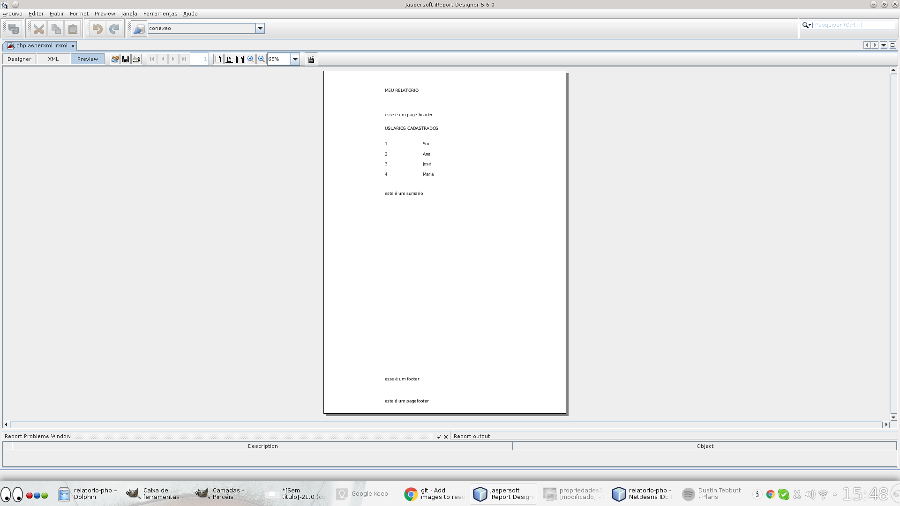

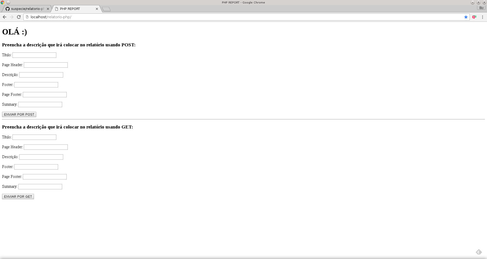

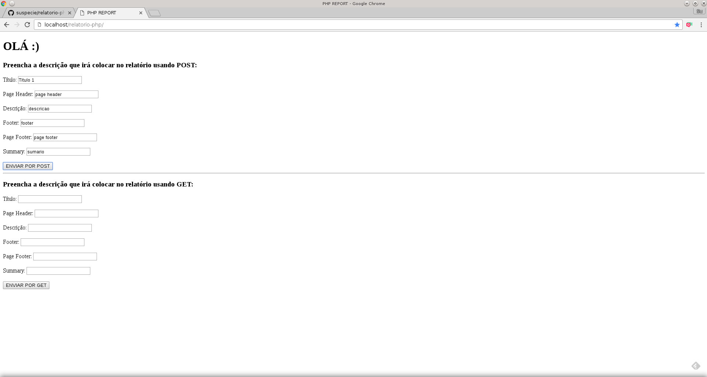

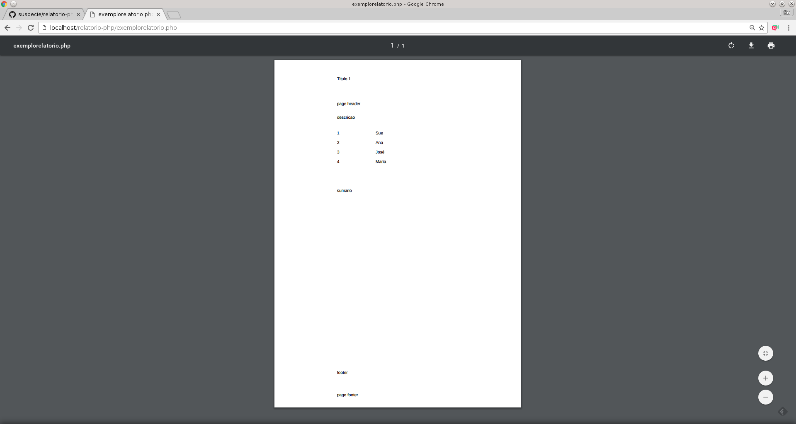

# INSTALANDO O PROJETO DO GIT

    1) Fazer git clone 
    2) Rodar script  banco/db_relatorio_php.sql
    3) Dar permissão: # chmod 777 relatorio-php/ -R
    4) Acessar o link: http://localhost/relatorio-php/
    5) Preencher os campos 
    6) Clicar no botão Enviar
    7) Pronto! :) você deverá ver o PDF

# FONTES UTILIZADAS NO PROJETO

    http://imasters.com.br/artigo/15736/php/usando-o-ireport-como-gerador-de-relatorios-para-php/?trace=1519021197&source=single
    https://www.vivaolinux.com.br/dica/Relatorios-do-iReport-no-PHP-com-PHPJasperXML
    http://chathurangat.blogspot.com.br/2012/03/jasperreports-with-php.html
    http://blog.ibusplus.com/2013/06/instalacion-de-ireport-en-linux-la.html
    http://javafree.uol.com.br/artigo/3154/Tutorial-de-IREPORT.html
    http://www.fpdf.org/
    http://community.jaspersoft.com/project/ireport-designer/releases 
    http://www.oracle.com/technetwork/pt/java/javase/downloads/jdk7-downloads-1880260.html
    http://www.simitgroup.com/?q=PHPJasperXML